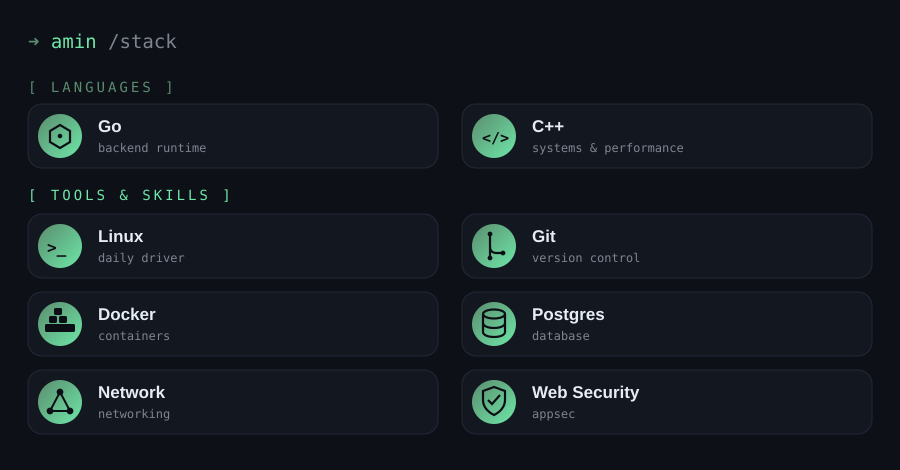

<!-- Terminal Typing Effect -->

  

---

### 💻 Core Languages & Arsenal

---

### 🚀 Featured Projects

| 🛡️ Project Name | ⚡ Description & Tech Stack | 🔗 Repository |
| :--- | :--- | :---: |
| **Unmatched Game** | High-performance C++17 implementation of the Unmatched board game.   `C++17`, `raylib`, `CMake`, `JSON` | [View Code](https://github.com/TAmin6002/Unmatched_Game.git) |

---
##

---

### 📚 Currently Exploring
* 🔒 **Offensive & Defensive Security** & Vulnerability Research
* 🌐 Advanced Low-Level Networking & Protocols
* ⚙️ High-Performance Go Backend Development

---

### 📊 System Telemetry (GitHub Stats)

  

  

---

### 🛰️ Connect with Me

  

<!-- GitHub Contribution Snake Animation -->

  <picture>
    <source media="(prefers-color-scheme: dark)" srcset="https://raw.githubusercontent.com/Platane/snk/output/github-contribution-grid-snake-dark.svg">
    <source media="(prefers-color-scheme: light)" srcset="https://raw.githubusercontent.com/Platane/snk/output/github-contribution-grid-snake.svg">
    
  </picture>

